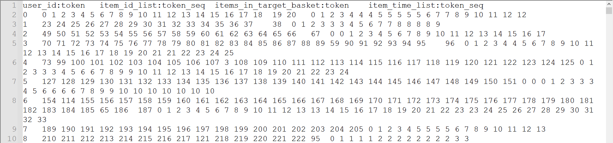
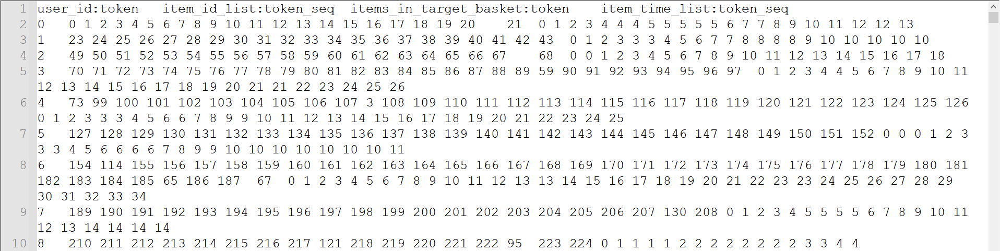
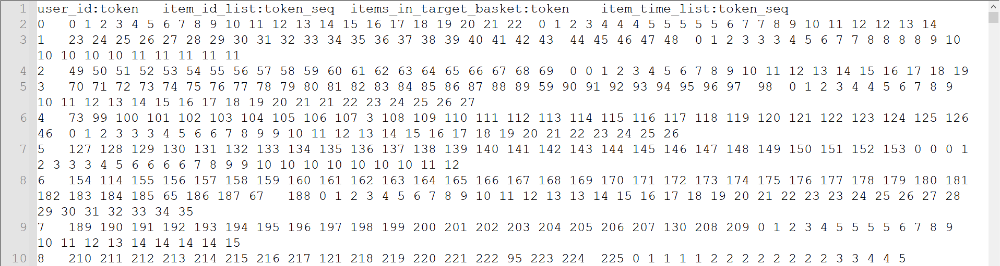

"# GeRec" 

For dataset preprocessing (e.g., Amazon-Electronics), we can run process_electronics.py in the dataset_preprocessing file as follows:

`python process_electronics.py --user_k 10 --item_k 10 --gpu_id 0`

Then, we can obtain "Electronics-Sample.train.inter", "Electronics-Sample.valid.inter", "Electronics-Sample.test.inter", "Electronics-Sample.user2index", and "Electronics-Sample.item2index" as shown in the dataset file.

For example,  the training, valid and test data are as follows:

"Electronics-Sample.train.inter":

"Electronics-Sample.valid.inter":

"Electronics-Sample.test.inter":

Note that "user_id" is the user ID;

"item_id_list" is the user's historical item sequence (items with the same timestamp forming a basket);

"items_in_target_basket" is the predicting items in the next basket; 

"item_time_list" is the timeline of chronological items in historical and predicting  baskets, and the same number of item time indicates the  same click/purchase timestamp (i.e., in the same basket).

And the tab (i.e., "\t") is used between two adjacent columns.  

*Note*: this library is being updated continuously.